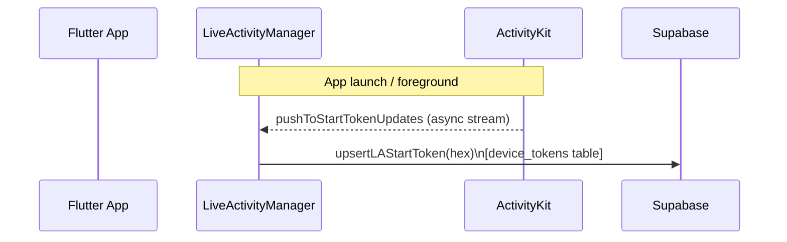
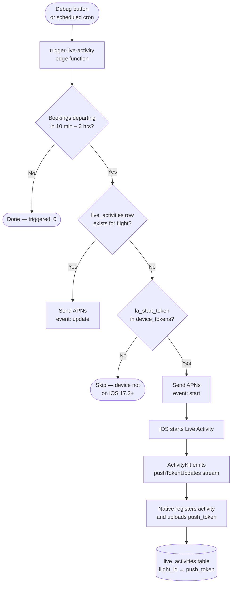
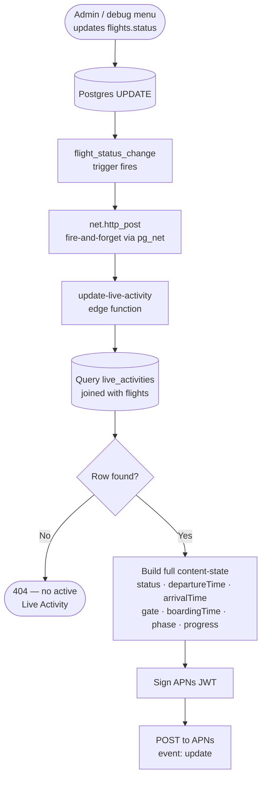
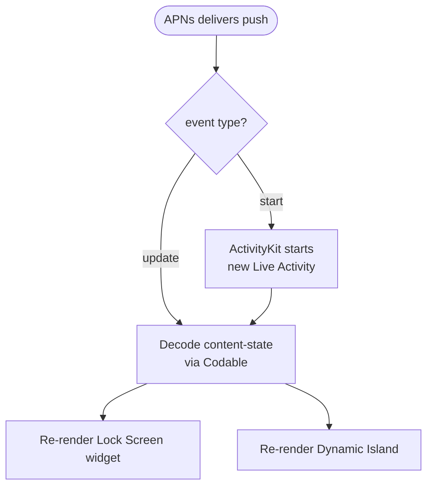
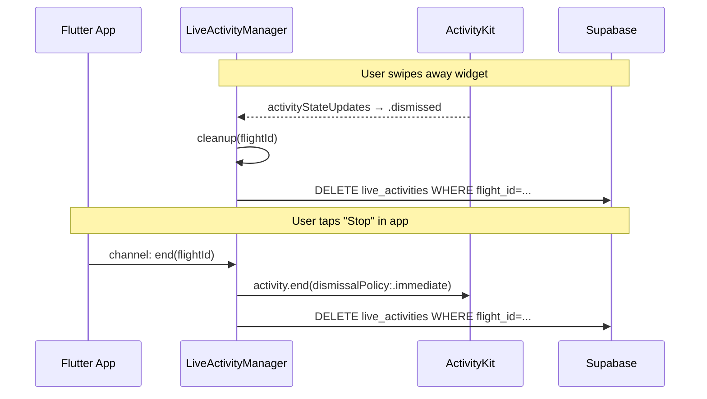

# Live Activity Flow

---

## 1 · Token Registration

**Key concepts**
- `la_start_token` — one per device, stored in `device_tokens`
- Allows the server to start a Live Activity without the app in the foreground (iOS 17.2+)

---

## 2 · Live Activity Start

**Key concepts**
- Duplicate guard — if `live_activities` row already exists, send `update` instead of `start`
- On `event: start`, iOS returns a per-activity `push_token` which is saved to `live_activities`

---

## 3 · Status Change → Push Update

**Key concepts**
- Trigger uses `begin/exception when others/null; end` so an HTTP failure never rolls back the `UPDATE`
- `update-live-activity` fetches `departure_at`/`arrival_at` from the `flights` join so the content-state is complete

---

## 4 · On-Device Rendering

---

## 5 · End / Dismissal

---

## Token types at a glance

| Token | Scope | Table | Purpose |
|---|---|---|---|
| `la_start_token` | Per device | `device_tokens` | Server pushes to start a new activity |
| `push_token` | Per activity | `live_activities` | Server sends updates to a running activity |
