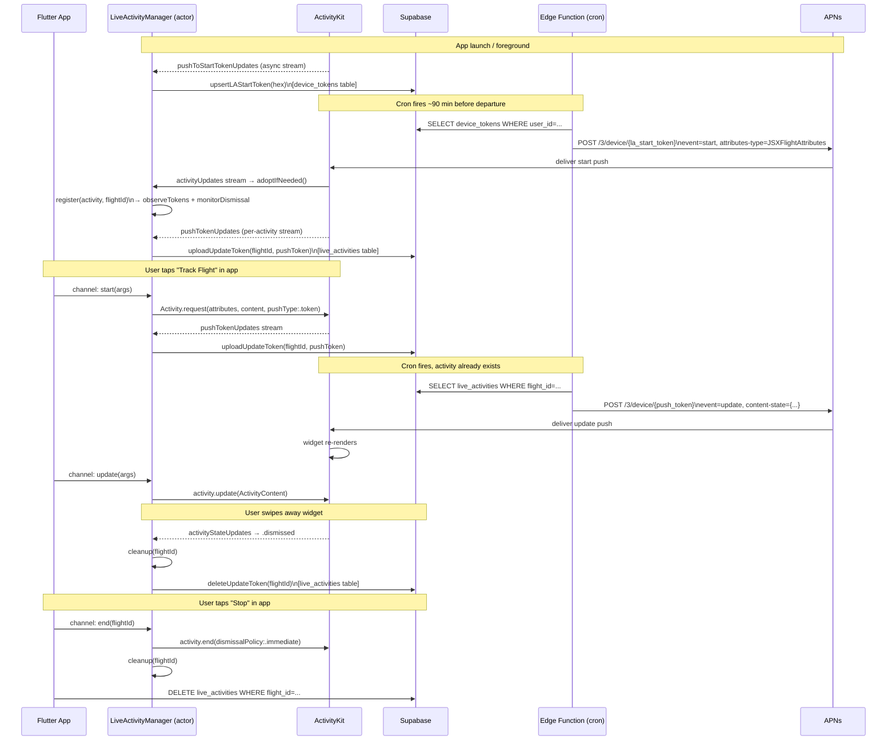

# Live Activity Flow

## Key concepts

- **Two token types** — `la_start_token` (one per device, `device_tokens` table) lets the server create an activity without the app in foreground. The per-activity `push_token` (one per flight, `live_activities` table) lets the server send updates.
- **Duplicate guard** — the edge function checks `live_activities` first: if a push token already exists it sends `event: update`, not `event: start`.
- **Multiple activities** — `LiveActivityManager` keys activities and push tokens by `flightId`, supporting concurrent Live Activities for different flights.
- **Dismissal cleanup** — `activityStateUpdates` detects `.dismissed` and deletes the DB row so the next cron run starts fresh.
